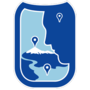

# Flyover Country Visualization Suite (FCVS)  

This repository contains the **Flyover Country Visualization Suite (FCVS)**, a multivariate visualization Javascript library currently built on [Leaflet](http://leafletjs.com/) for integration into the Flyover Country mobile app.

## What is Flyover Country?

[Flyover Country](http://fc.umn.edu/)  is a National Science Foundation funded offline mobile app for geoscience outreach and data discovery. The app exposes interactive geologic maps from Macrostrat.org, fossil localities from Neotomadb.org and Paleobiodb.org, core sample localities from LacCore.org, Wikipedia articles, offline base maps, and the user’s current GPS determined location, altitude, speed, and heading. The app analyzes a given flight path and caches relevant map data and points of interest (POI), and displays these data during the flight, without in flight wifi. By downloading only the data relevant to a particular flightpath, cache sizes remain reasonable, allowing for a robust experience without an internet connection.

The FCVS will be implemented into future versions of the app.

## Multivariate Visualization

This FCVS was deigned to visualize large multivariate datasets from the [Neotoma Database](https://www.neotomadb.org/). The suite includes four visualizations to explore Neotoma's pollen data:
* Petal Plots
* Stacked Bar Charts
* Radar Charts
* Flagpole Diagrams

These visualizations were chosen after conducting a quantitative content analysis on all the visualizations from papers in the [Neotoma Citations Google Scholar page](https://scholar.google.com/citations?user=idoixqkAAAAJ&hl=en). The analysis provided insight into extant visualization methods in the field of paleoecology and informed selection of the particular examples included in the suite. The visualizations are created using [D3](https://github.com/d3/d3), a JavaScript library for interactive data visualization, and native [Leaflet](http://leafletjs.com/) icon functions.

The FCVS was designed to address the problem of visualizing large multivariate datasets in a cartographic interface on a mobile device. 

### Petal Plot

*Screenshot of Petal Plot*

A **petal plot** contains *n* custom icons rotated around a single location, where *n* is the number of variables in the data shown. The base of each icon located at the same latitude and longitude and each icon is rotated 360/*n* degrees. It uses color and size to encode nominal and numerical data, respectively. Each color (in this example) is associated with a distinct taxon of pollen found at that site and is sized according to its value.

### Stacked Bar Chart

*Screenshot of Stacked Bar Chart*

A **stacked bar chart** depicts proportionally sized bars on top of each other, with the base of the stack centered at the latitude and longitude of the site. It uses color and size to encode nominal and numerical data, respectively. 

### Radar Chart

*Screenshot of Radar Chart*

A **radar chart** has a polygon with *n* vertices along equi-angular axes, where *n* is the number of variables in the data shown. Each vertex and axis correspond to a single variable. The distance a particular vertex is displaced along the axis from the center of the chart is proportional to the value for that particular variable. Each chart is centered at the latitude and longitude of the site.

### Flagpole Diagram

*Screenshot of Flagpole Diagram*

A **flagpole diagram** is a stacked area chart that is rotated 90 degrees, depicting time on the y-axis and value on the x-axis. The base of the graph is centered at the latitude and longitude of the site. It uses color and size to encode nominal and numerical data, respectively. 

## Data

## Example
